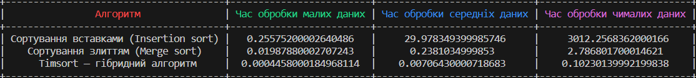

# Завдання

## Були обрані три алгоритми сортування для порівняння:

1. Merge sort
2. Insertion sort
3. Timsort

В якості вхідних даних використовувалися три масиви цілих додатніх чисел різного розміру:

- 1000
- 10000
- 100000

Використовуючи модуль `timeit`, проведено вимірювання часу сортування для кожного з алгоритмів на основі 5 замірів.
Результати представлені у таблиці нижче:



| Алгоритм                              | Час обробки малих даних | Час обробки середніх даних | Час обробки чималих даних |
|---------------------------------------|-------------------------|----------------------------|---------------------------|
| Сортування вставками (Insertion sort) | 0.25575200002640486     | 29.978349399985746         | 3012.2568362000166        |
| Сортування злиттям (Merge sort)       | 0.01987880002707243     | 0.2381034999853            | 2.786801700014621         |
| Timsort — гібридний алгоритм          | 0.0004458000184968114   | 0.00706430000718683        | 0.10230139992199838       |

## Висновок

Важливим висновком є те, що поєднання сортування злиттям і сортування вставками, яке використовується в
```Timsort``` , дозволяє отримати високий рівень ефективності, особливо при роботі з великими обсягами вхідних даних. Це
робить Timsort оптмальним вибором для ситуацій, де швидкодія алгоритму мають ключове значення.